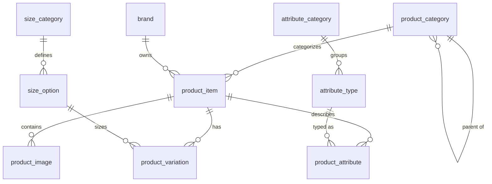

# 🛍️ ERP Product Management System 🛍️

## 🌟 Welcome to Our ERP Project! 🌟

Hello there, fellow database enthusiasts! Welcome to the **most exciting ERP product management system** you'll ever lay your eyes on! This masterpiece was crafted with love, caffeine, and a touch of database magic by our incredible team for the Advanced Database Systems class.

## 🚀 Project Overview

Our ERP system is designed to manage product information with the precision of a Swiss watch and the flexibility of a yoga instructor. We've built a comprehensive database schema that handles everything from basic product details to complex attribute management, size options, and brand information.

## 🏗️ Database Schema

### Table Relationships Diagram

Below is a visual representation of our database schema showing how all tables are connected. Each line represents a relationship, with the crow's foot notation indicating one-to-many relationships.



## 📋 Table Descriptions

### 🖼️ Product Image
Stores images related to product items.
- **PK**: `image_id`
- **FK**: `product_item_id` references `product_item(product_item_id)`
- **Special Features**: 
  - Auto-updating timestamps
  - Only one primary image per product
  - Enforced file type validation

### 🏷️ Product Category
Manages hierarchical product categories.
- **PK**: `category_id`
- **FK**: `parent_category_id` references `product_category(category_id)` (self-referential)
- **Special Features**:
  - Automatically generates URL slugs
  - Recursive category path generation
  - SEO metadata fields

### 📦 Product Item
The core table containing main product information.
- **PK**: `product_item_id`
- **FK**: 
  - `brand_id` references `brand(brand_id)`
  - `category_id` references `product_category(category_id)`
- **Special Features**:
  - Full-text search capability
  - JSON specifications storage
  - Auto-slug generation

### 🏢 Brand
Stores brand information for products.
- **PK**: `brand_id`
- **Special Features**:
  - Brand statistics function
  - URL slug auto-generation
  - Brand color validation

### 🔄 Product Variation
Manages different variations of products (size, color).
- **PK**: `variation_id`
- **FK**: 
  - `product_item_id` references `product_item(product_item_id)`
  - `size_option_id` references `size_option(size_option_id)`
- **Special Features**:
  - Stock tracking with audit log
  - Low stock reporting function
  - Color code validation

### 📏 Size Category
Organizes size options into logical categories.
- **PK**: `size_category_id`
- **Special Features**:
  - Measurement unit validation
  - Pre-defined common size categories

### 🧮 Size Option
Defines specific sizes within categories.
- **PK**: `size_option_id`
- **FK**: `size_category_id` references `size_category(size_category_id)`
- **Special Features**:
  - JSON storage for dimensional data
  - International size equivalents
  - Pre-populated common size options

### 🔍 Product Attribute
Stores attribute values for products.
- **PK**: `attribute_id`
- **FK**: 
  - `product_item_id` references `product_item(product_item_id)`
  - `attribute_type_id` references `attribute_type(attribute_type_id)`
- **Special Features**:
  - Type-specific value storage
  - Automatic type casting
  - Optimized indexing for filtering

### 🗂️ Attribute Category
Groups attribute types into logical categories.
- **PK**: `category_id`
- **Special Features**:
  - Pre-populated common categories
  - Attribute counting function

### 📊 Attribute Type
Defines types of attributes with validation rules.
- **PK**: `attribute_type_id`
- **FK**: `category_id` references `attribute_category(category_id)`
- **Special Features**:
  - Multiple data type support
  - Value validation function
  - Allowed values lists
  - Pre-populated common attribute types

## 🎯 Key Features

### 🔐 Data Integrity
- Foreign key constraints ensure referential integrity
- CHECK constraints validate data before insertion
- Unique constraints prevent duplicate records
- Custom validation functions for complex rules

### 📈 Performance Optimization
- Strategic indexes on frequently queried columns
- Composite indexes for common filter operations
- Full-text search capabilities for product search
- Optimized query functions for common operations

### 🧠 Smart Functions
- Automatic URL slug generation
- Stock tracking with audit trail
- Size conversion and availability checking
- Product attribute validation and type casting
- Hierarchical category path generation

### 🔄 Triggers
- Automatic timestamp updates
- Enforce single primary image per product
- Stock movement audit logging
- Attribute value type casting

## 👨‍💻 How to Use This Project

1. **Setup the Database**:
   ```bash
   # Create a new MySQL database
   mysql -u root -p -e "CREATE DATABASE erp_product_management;"
   
   # Run the SQL files in the following order:
   mysql -u root -p erp_product_management < brand.sql
   mysql -u root -p erp_product_management < product_category.sql
   mysql -u root -p erp_product_management < attribute_category.sql
   mysql -u root -p erp_product_management < attribute_type.sql
   mysql -u root -p erp_product_management < product_item.sql
   mysql -u root -p erp_product_management < size_category.sql
   mysql -u root -p erp_product_management < size_option.sql
   mysql -u root -p erp_product_management < product_variation.sql
   mysql -u root -p erp_product_management < product_attribute.sql
   mysql -u root -p erp_product_management < product_image.sql
   ```

2. **Test It Out**:
   ```sql
   -- Add a brand
   INSERT INTO brand (brand_name, url_slug) VALUES ('CoolTech', 'cooltech');
   
   -- Add a category
   INSERT INTO product_category (category_name, url_slug) VALUES ('Electronics', 'electronics');
   
   -- Add a product
   INSERT INTO product_item (brand_id, category_id, product_name, product_description, sku, url_slug, base_price)
   VALUES (1, 1, 'Amazing Gadget', 'This gadget will change your life!', 'AG-001', 'amazing-gadget', 499.99);
   ```

## 📝 Requirements

Create a `requirements.txt` file if you plan to use Python scripts for database management or automation. Example:

```
mysql-connector-python
sqlalchemy
pandas
```

## 🎓 Course Information

**Course**: Database Systems  
**Trainors**: Dr. Data Wizard  
**Cohort**: Feb 2025  
**Program**: Powerlearn Project

## 📝 Notes on Implementation

- Designed for MySQL 8+
- Uses advanced features like JSON, generated columns, and full-text search
- Implements best practices for database design and optimization
- Includes comprehensive documentation in SQL comments

## 🎉 Conclusion

We had a blast creating this database schema and learned so much in the process! We hope you enjoy exploring our work as much as we enjoyed building it. Remember, good database design is like a good joke - it's all about proper delivery and avoiding table drops! 😉

---

*"In SQL we trust, but we always verify with a good WHERE clause!"* - The ERP Team